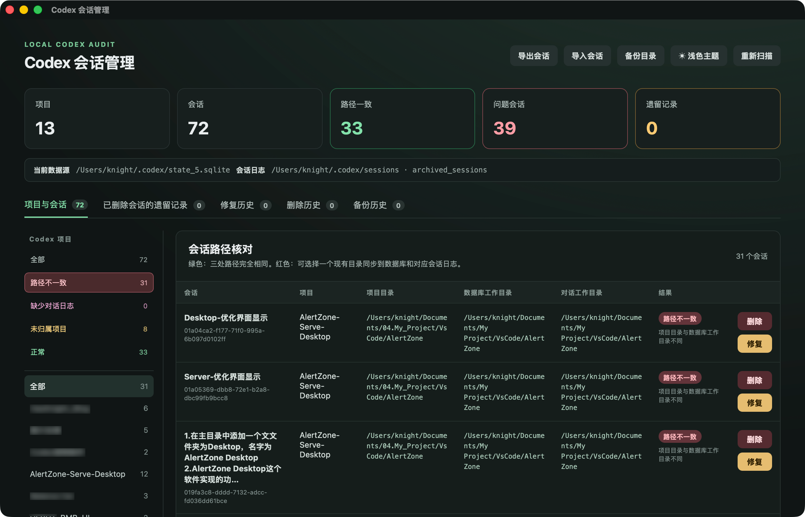
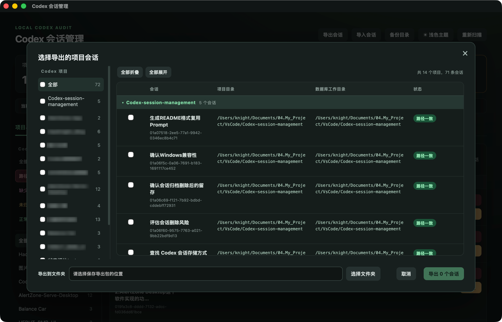

# Codex 会话管理

<div align="center">
  

  **核查、修复、迁移与备份 Codex 会话**

  [](./src-tauri/tauri.conf.json)
  [](#-系统要求)
  [](https://tauri.app/)
  [](https://www.rust-lang.org/)
  [](https://www.typescriptlang.org/)

  [功能特性](#-功能特性) · [界面预览](#-界面预览) · [安装运行](#-安装与运行) · [使用说明](#-使用说明) · [安全机制](#️-安全机制)
</div>

## 🔍 概述

Codex 会话管理是一款基于 Tauri + Rust 的本地桌面工具，用于检查并修复 Codex 项目、数据库和会话日志中的工作目录不一致问题。

应用完全在本机运行，并支持会话导入导出、删除恢复和备份管理。

## ✨ 功能特性

- **路径核查与修复**：检查项目、数据库和会话日志中的工作目录，并修复不一致的路径
- **项目批量操作**：右键项目可将全部问题会话统一修复到同一路径，或删除项目下的全部会话及 Codex 项目配置
- **子代理同步**：可选同步修复主会话派生的全部子代理
- **会话迁移**：按项目批量导出和导入会话，方便在不同电脑间迁移
- **删除与恢复**：删除普通会话或遗留日志，并通过历史备份执行恢复
- **自动备份**：修改数据前自动备份相关数据库和日志文件
- **桌面支持**：兼容 macOS 与 Windows，提供跟随系统及 Codex 风格的深浅外观和中文界面

## 📸 界面预览

### 🔎 会话核查与路径核对

主界面汇总项目、会话和异常数量，并可按状态或项目筛选会话，快速定位工作目录不一致、未归属项目及日志缺失等问题。

<div align="center">
  
</div>

### 📦 会话导出

导出界面支持按项目折叠、展开和批量选择会话，并将数据库快照、项目配置、会话关系及 JSONL 日志整理为迁移包。

<div align="center">
  
</div>

## 🧭 状态说明

| 状态 | 含义 | 建议操作 |
| --- | --- | --- |
| 路径一致 | 项目、数据库与会话日志工作目录一致 | 无需处理 |
| 路径不一致 | 至少一处工作目录与项目根目录不同 | 核对目标目录后备份并修复 |
| 未归属项目 | 会话没有关联当前 Codex 项目 | 可保留，或在 Codex 中重新归类 |
| 找不到日志 | 数据库存在会话，但未找到对应 JSONL | 先检查数据完整性，不执行强制修复 |

## 📦 安装与运行

如果懒得看下面安装教程 直接把网址给codex叫他下载就行了

### 系统要求

- **Codex**：至少成功启动过一次，以生成本机状态数据库和会话目录
- **macOS**：安装 Xcode Command Line Tools
- **Windows**：Windows 10/11、Microsoft C++ Build Tools 与 WebView2 Runtime
- **开发环境**：Node.js、npm 和 Rust stable 工具链

Tauri 的完整环境准备请参阅 [官方前置要求](https://v2.tauri.app/start/prerequisites/)。

### 从源码运行

```bash
# 克隆仓库
git clone https://github.com/HaoKnight/Codex-session-management.git
cd Codex-session-management

# 安装前端依赖
npm install

# 启动桌面开发模式
npm run tauri dev
```

### 构建检查

```bash
# TypeScript 类型检查与前端生产构建
npm run build

# Rust 测试
cargo test --manifest-path src-tauri/Cargo.toml
```

### 打包应用

建议在目标操作系统上原生构建：

```bash
# 构建当前平台支持的全部安装格式
npm run tauri build

# macOS：仅生成 .app
npm run tauri build -- --bundles app

# Windows：仅生成 NSIS 安装程序
npm run tauri build -- --bundles nsis
```

构建产物位于 `src-tauri/target/release/bundle/`。公开分发前，请为 macOS 应用完成开发者签名与公证，并为 Windows 安装包配置代码签名。

## 🚀 使用说明

### 1. 扫描会话

启动应用后会自动读取 Codex 数据。主界面按项目展示会话数量及异常数量，可使用左侧状态和项目筛选快速定位问题。

### 2. 修复项目迁移后的路径

1. 找到标记为“路径不一致”的会话
2. 点击“修复”并选择一个已存在的绝对目录

也可以右键左侧项目并选择“修复项目”，一次选择统一目标目录。管理器会同步项目根目录、项目下主会话及其子代理；缺少 JSONL 日志的会话会跳过并在结果中说明。

右键项目选择“删除项目”会删除该项目下全部会话、子代理和 Codex 项目配置，但不会删除磁盘上的项目源代码目录。该操作需要二次确认并要求先退出 Codex。
3. 按需开启“同时修复子代理会话”
4. 完全退出 Codex
5. 确认“备份并修复”，完成后重新启动 Codex 复查

### 3. 导出与导入会话

1. 点击页面标签栏右侧的“导出会话”
2. 按项目选择需要迁移的会话，并指定导出目录
3. 在另一台电脑点击页面标签栏右侧的“导入会话”
4. 选择导出包中的 `manifest.json`
5. 为导出包中的每个项目选择当前电脑上的项目目录
6. 关闭 Codex 后确认导入；应用会同步转换数据库、侧栏项目归属和 JSONL 日志中的工作目录

### 4. 删除与恢复

- 普通会话删除需要连续确认两次，执行前会自动备份
- 遗留 JSONL 删除仅针对当前数据库未引用的日志
- “删除历史”中的记录可执行回退
- 清理备份后，对应历史将无法继续回退

### 5. 管理备份

默认备份目录为：

```text
~/.codex/session-manager-backups/
```

可通过页面标签栏右侧的“备份目录”选择其他绝对路径，并在“备份历史”页面集中查看或清理备份。

## 🛡️ 安全机制

- 修复、删除和回退操作均先创建本地备份；导入操作不创建额外备份
- 修复、导入和回退前会检查 Codex 是否已完全退出，避免运行中的进程写回旧数据
- JSONL 修复只替换精确匹配的 `cwd` 字段，不改写聊天内容中的路径或文件链接
- 子代理级联修复要求范围内的会话日志完整，否则整次操作在写入前取消
- 导入包采用路径边界校验，并核对会话 ID 与日志归属
- 删除目标限制在 Codex 管理的数据范围内，并保留可核查的操作清单
- 应用不会扫描或删除 `.codex` 中的令牌、记忆、图片、插件、浏览器数据或其他无关文件

> [!WARNING]
> 本工具会在确认后修改 Codex 的本地数据库和会话日志。重要数据请保留额外备份，且不要在 Codex 仍运行时手动编辑这些文件。

## 📂 本地数据

| 数据 | 默认位置 | 用途 |
| --- | --- | --- |
| 状态数据库 | `~/.codex/state_5.sqlite` 或 `~/.codex/sqlite/state_5.sqlite` | 项目、会话及工作目录 |
| 当前会话日志 | `~/.codex/sessions/` | 当前 JSONL 会话记录 |
| 已归档会话日志 | `~/.codex/archived_sessions/` | 已归档 JSONL 会话记录 |
| 桌面目录缓存 | `~/.codex/sqlite/codex-dev.db` | Codex 会话目录缓存 |
| 操作备份 | `~/.codex/session-manager-backups/` | 修复、删除与回退备份 |

Windows 默认使用 `%USERPROFILE%\.codex`。如 Codex 数据位于其他位置，可设置：

| 环境变量 | 作用 |
| --- | --- |
| `CODEX_HOME` | 指定 Codex 数据目录 |
| `CODEX_BIN` | 指定兼容的 `codex` 可执行文件，供会话删除调用 app-server |

## 🧱 技术栈

- [Tauri 2](https://tauri.app/)：跨平台桌面容器
- [Rust](https://www.rust-lang.org/)：SQLite、文件操作、备份与安全校验
- [TypeScript](https://www.typescriptlang.org/) + [Vite](https://vite.dev/)：桌面界面与交互
- [SQLite](https://www.sqlite.org/) + JSONL：Codex 本地会话数据

## 🤝 贡献与反馈

欢迎提交 Issue 或 Pull Request。涉及数据库、删除、导入或回退逻辑的修改，请同时补充相应测试，并确保：

```bash
npm run build
cargo test --manifest-path src-tauri/Cargo.toml
```

均可通过。

---

<div align="center">
  <p>由 <strong>H-Knight</strong> 制作</p>
  <p>
    <a href="https://github.com/HaoKnight/Codex-session-management">GitHub 仓库</a> ·
    <a href="https://github.com/HaoKnight/Codex-session-management/issues">问题反馈</a>
  </p>
</div>
